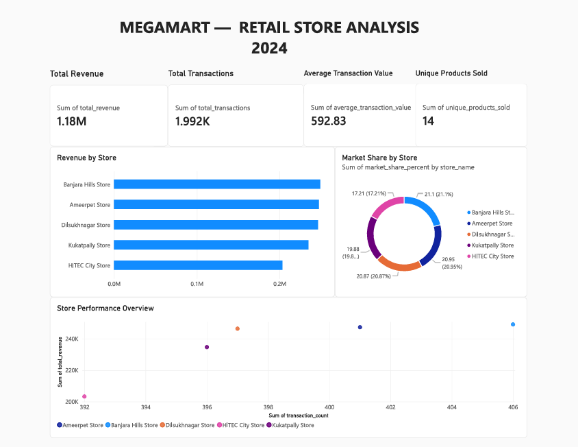
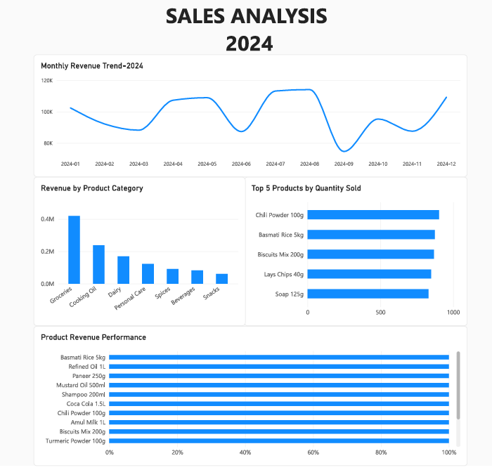
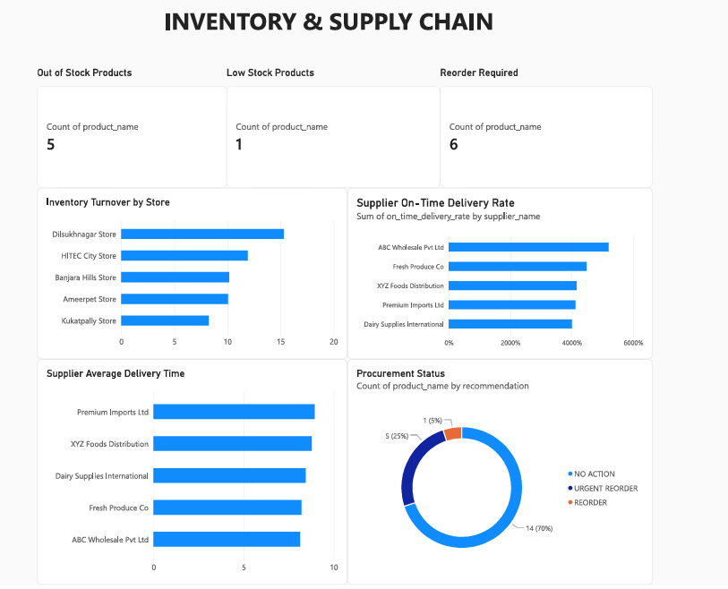

# MegaMart Supermarket Data Engineering & BI Project

## 📌 Project Overview

MegaMart is an end-to-end data engineering and business intelligence project developed using Databricks, Python, SQL and Power BI.

The project simulates a supermarket chain and demonstrates the complete data pipeline from data generation and ingestion to data validation, transformation, analytical processing and business dashboard development.

The final solution provides insights into:

- Retail store performance
- Sales trends and product performance
- Inventory levels and turnover
- Supplier delivery performance
- Procurement and reorder requirements

---

## 🏗️ Project Architecture

```text
Sample / Raw Data
       ↓
Databricks
       ↓
Data Generation & Ingestion
       ↓
Data Validation
       ↓
Data Cleaning & Transformation
       ↓
Analytical Tables
       ↓
Business Analysis
       ↓
Power BI
       ↓
Interactive Dashboards

## 📊 Dashboard Preview

### Retail Store Analysis



### Sales Analysis



### Inventory & Supply Chain


